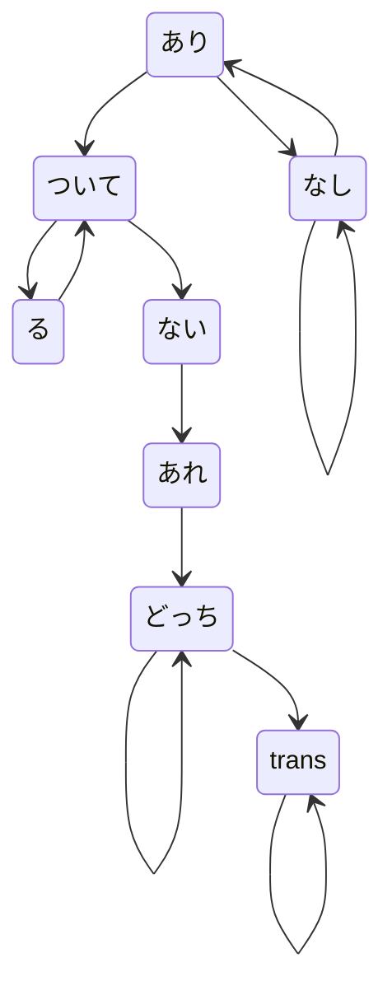

# OnimizationFlow

```mermaid
stateDiagram-v2 
あり-->なし
なし-->あり
なし-->なし
あり-->ついて
ついて-->る
る-->ついて
ついて-->ない
ない-->あれ
あれ-->どっち
どっち-->どっち
どっち-->trans
trans-->trans
```

Inspired from [@sheepla](https://github.com/sheepla)'s tweet
