# OnimizationFlow

## Flow

```mermaid
stateDiagram-v2 
あり-->なし
なし-->あり
なし-->なし
あり-->ついて
ついて-->る
る-->ついて
ついて-->ない
ない-->あれ
あれ-->どっち
どっち-->どっち
どっち-->trans
trans-->trans
```

## Inspire source
Inspired from [@sheepla](https://github.com/sheepla)'s tweet

<blockquote class="twitter-tweet">
図です <a href="https://t.co/I1mhv6Lbks">pic.twitter.com/I1mhv6Lbks</a>
&mdash; ((🐑++)) (@Sheeeeepla) <a href="https://twitter.com/Sheeeeepla/status/1633038985336606721?ref_src=twsrc%5Etfw">March 7, 2023</a></blockquote> 
